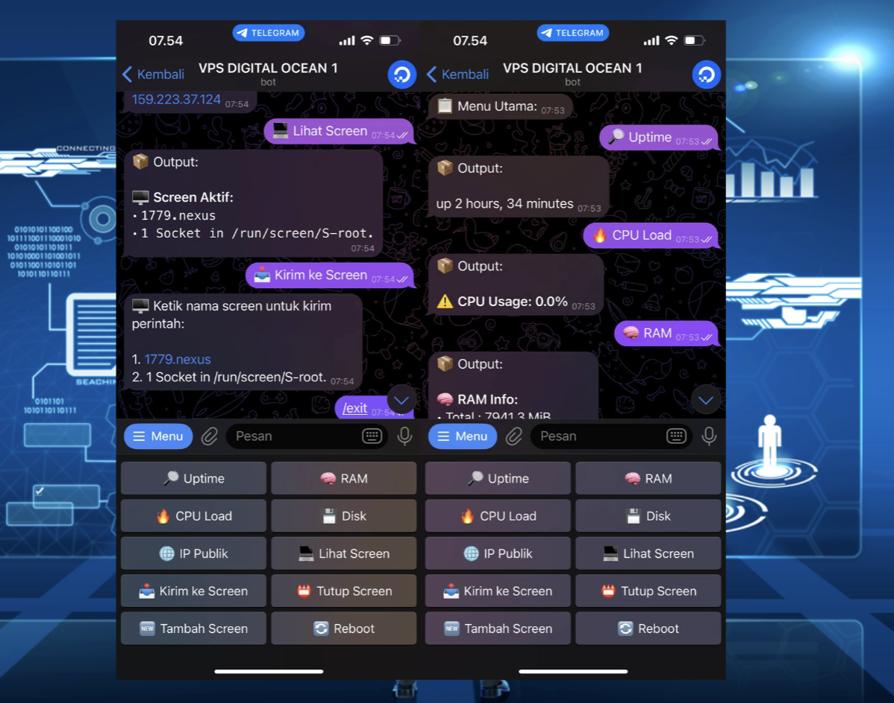

◾ Fungsi BOT 
- ✅ Cek Usage CPU,RAM,DISK
- ✅ Cek Uptime
- ✅ Cek IP Public
- ✅ Restart VPS
- ✅ Cek Screen yang aktif
- ✅ Kirim perintah ke screen
- ✅ Tambah screen baru
- ✅ Tutup screen aktif

◾ Cara Installasi Script Telegram VPS BOT
* Info Repository nya bisa hubungi melalui:
   * 🐦 Twitter/X: [@hexByte](https://x.com/fruitchest8474)
   * 📱 WhatsApp: [+62 822 82586624](https://wa.me/6282282586624)
   *  Telegram : [HexByte](https://t.me/topengdigital)

◾ Jika sudah mendapatkan repository nya boleh siapkan 🗒
  * Buat BOT telegram kamu terlebih dahulu bisa lewat (@BotFather)
  * Copy Token BOT yang sudah kamu buat
  * Copy ID telegram kamu untuk izinkan akses, bisa lewat (@userinfobot)
  * Lanjut ke installasi yang sudah dibuat sesimple mungkin 👍


 * Masuk ke Folder Directory
```bash
cd TELEGRAM_VPS_BOT
```
 * Jalankan perintah berikut ini untuk installasi BOT
```bash
chmod +x install_bot.sh
./install_bot.sh
```
 * Tunggu proses nya dan masukan BOT Token & Telegram user ID sebagai Admin
 * Jika sudah selesai BOT akan berjalan Otomatis

 * Cek Status
```bash
sudo systemctl status telegrambot
```
 * Cek Log
 ```bash
journalctl -u telegrambot -f
```
* Stop & Restart Bot
```bash
sudo systemctl stop telegrambot
```
```bash
sudo systemctl restart telegrambot
```
Jika sudah running bot otomatis berjalan ketika server restart
# Semoga BOT ini bisa membantu memudahkan pekerjaan kamu ☺️
Winzzy
